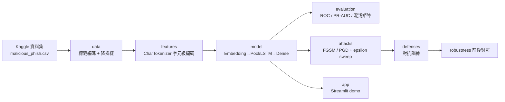
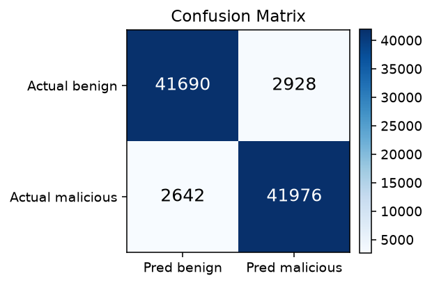
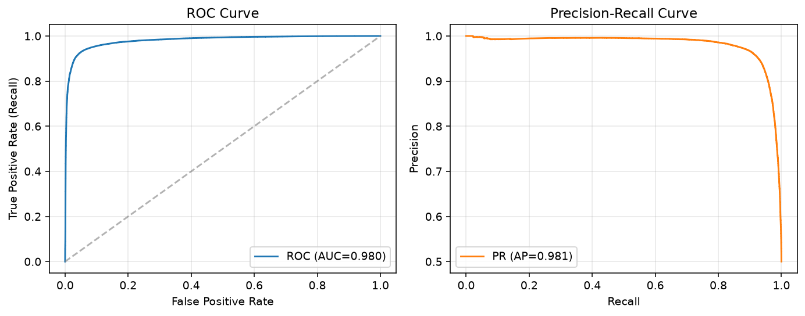
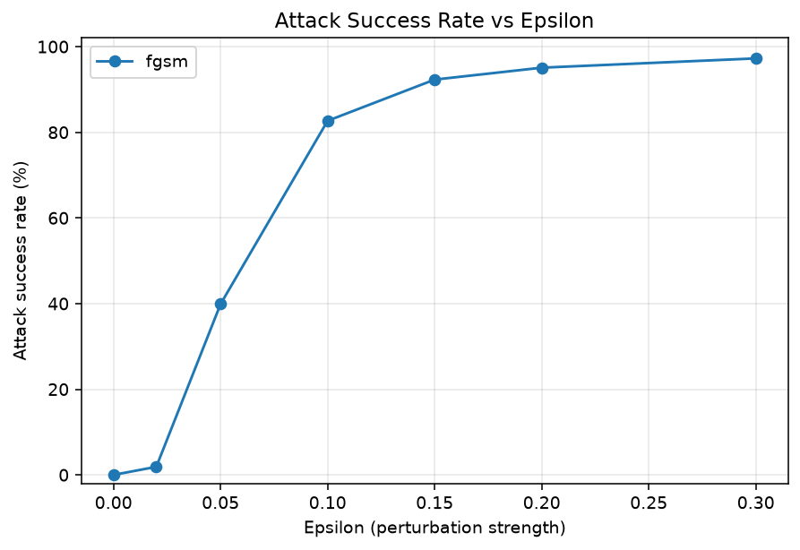
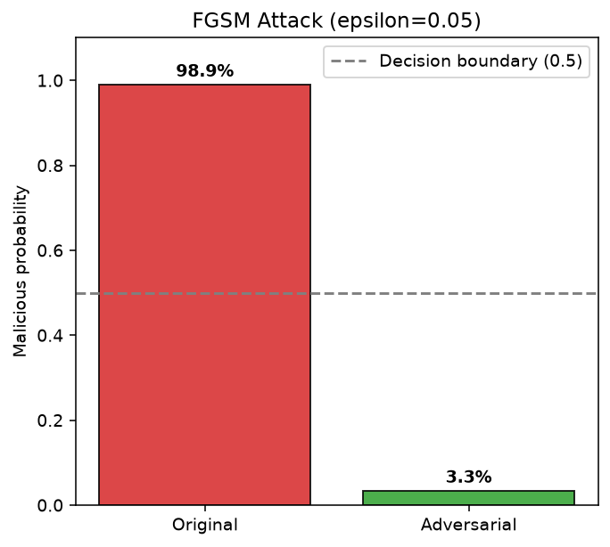
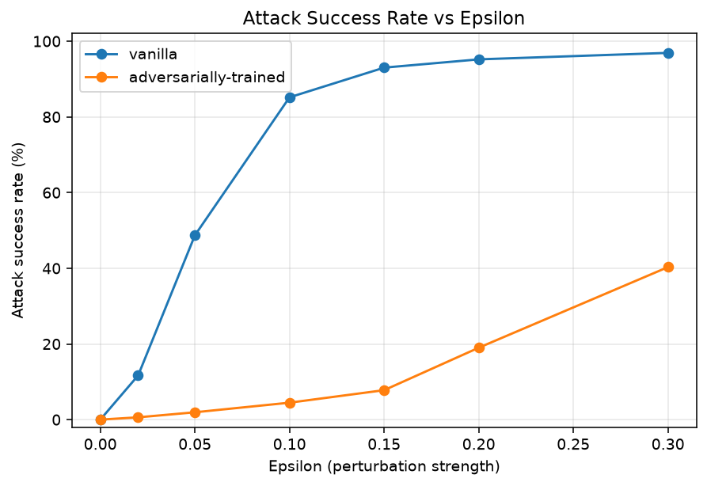

# 🛡️ URLGuard — 惡意網址偵測 × 對抗式攻防

以深度學習偵測惡意/釣魚網址,並實作 **FGSM / PGD 對抗式攻擊**與**對抗訓練防禦**,
完整走一遍「**訓練 → 攻擊 → 量化 → 防禦 → 再量化**」的資安攻防閉環。

<!-- 把 your-account 換成你的 GitHub 帳號後,badges 即會生效 -->


> 🔗 線上 Demo:_部署到 [Streamlit Community Cloud](https://streamlit.io/cloud) 後把連結貼在這裡_
> (本機執行:`urlguard serve`)

---

## 為什麼重要

釣魚網址是社交工程攻擊的第一步。即使我們訓練出高準確率的偵測模型,只要攻擊者能用
**對抗式擾動(adversarial perturbation)** 稍微修改輸入就繞過偵測,整條防線就形同虛設。
本專案不只做「偵測」,更站在攻擊者視角驗證模型的脆弱性,並用**對抗訓練**把模型硬化,
量化防禦前後的差異——這正是 AI 資安真正在乎的問題。

## 威脅模型(Threat Model)

- **白箱(white-box)**:攻擊者可存取模型與其梯度。
- **攻擊空間**:對模型內部的 **Embedding 特徵向量**施加擾動(URL 是離散字元,無法直接對輸入做梯度下降)。
- **誠實聲明**:擾動後的 embedding **不一定對應可實際輸入的真實 URL**,因此這是
  「**證明決策邊界脆弱性**」的示範,而非端到端可部署的黑箱攻擊。真正的離散字元級黑箱攻擊
  (HotFlip / TextFooler / homoglyph 改寫)列於[未來工作](#未來工作)。

## 系統架構



模組邊界嚴格分離:`data` 不依賴 TensorFlow、`features` 為純 Python(可獨立測試)、
`attacks/defenses` 只依賴 `model`+`features`、`cli.py` 是唯一解析參數的地方。

## 快速開始

```bash
# 1. 安裝(可編輯模式 + 開發/ app 依賴)
pip install -e ".[dev,app]"      # 或: make setup

# 2. 下載資料集(需 Kaggle 憑證,見 .env.example)
urlguard download-data           # 或: make data

# 3. 訓練 → 評估 → 攻擊 → 對抗訓練 → 啟動 demo
urlguard train    --config configs/default.yaml
urlguard evaluate --config configs/default.yaml
urlguard attack   --config configs/default.yaml --method fgsm --sweep
urlguard adv-train --config configs/default.yaml --epsilon 0.1
urlguard serve
```

> Windows 使用者若無 `make`,直接執行上面對應的 `urlguard ...` 指令即可。
> 任何指令都能用 `--set key=value` 覆蓋設定,例如 `--set attack.epsilon=0.2 --set model.type=lstm`。

## 資料與方法

- **資料集**:[Malicious URLs Dataset](https://www.kaggle.com/datasets/sid321axn/malicious-urls-dataset)(約 65 萬筆)。
- **類別不平衡**:原始 benign 428,103 筆 vs 惡意 223,088 筆。若不處理,模型「全猜良性」就有 ~66% 準確率卻毫無偵測力。
  本專案以**降採樣**平衡兩類(並在文件討論其代價:丟棄了約 20 萬筆良性樣本,真實流量分佈下需再看 PR-AUC 與低 FPR 下的 recall)。
- **字元級 Tokenizer**:採 `char_level`,因為駭客愛用混淆字元(`g00gle`、`paypa1`)。字元層級比單字層級更能抓到這類細微異常。
- **每個超參數都有理由**:`max_length=100`(涵蓋絕大多數 URL)、`vocab_size=5000`(字元集的安全上界)、`embedding_dim=16`、`epsilon` 掃描 `[0, 0.02, 0.05, 0.1, 0.15, 0.2, 0.3]`——全部集中在 [`configs/default.yaml`](configs/default.yaml)。

## 模型結果

在平衡測試集上(`configs/default.yaml`,5 epochs):

| 指標 | 數值 |
|---|---|
| Accuracy | ~0.94 |
| Precision (malicious) | ~0.94 |
| Recall (malicious) | ~0.94 |
| F1 (malicious) | ~0.94 |
| ROC-AUC / PR-AUC | 執行 `urlguard evaluate` 後產生 |

> 圖表由 `urlguard evaluate` 產生於 `docs/images/`:

<p>
  
  
</p>

資安場景中,**漏報(False Negative,把惡意判成良性)成本最高**,因此我們不只看 accuracy,
還報告 **PR-AUC** 與**固定低誤報率(FPR=1%)下的 recall**。

## 對抗攻擊:FGSM / PGD

FGSM 的核心:訓練是沿梯度**降低** loss,攻擊則沿 `sign(∇J)` 方向**增大** loss。

$$adv = emb + \epsilon \cdot \text{sign}(\nabla_{emb} J(\theta, emb, y))$$

原講座 notebook 在 `epsilon=0.05` 單點攻擊「失敗」(惡意機率 0.976 → 0.615,仍 > 0.5)。
本專案把它改寫成**量化的攻擊強度分析**:對整批高信心惡意樣本掃描 epsilon,畫出攻擊成功率曲線,
並加入更強的 **PGD 迭代攻擊**(L∞ 投影)真正把機率壓破 0.5。

<p>
  
  
</p>

## 防禦:對抗訓練

在 embedding 空間每個 batch 即時生成 FGSM/PGD 對抗樣本,以「乾淨 + 對抗」混合損失重訓,
再用**同一條 epsilon 掃描**比較 vanilla vs 對抗訓練後的模型。

| 模型 | 乾淨 Accuracy | Robust Acc (FGSM, ε=0.1) | Robust Acc (PGD, ε=0.1) |
|---|---|---|---|
| Vanilla | 執行 `urlguard adv-train` 後產生 | | |
| 對抗訓練 | | | |

<p></p>

對抗訓練通常會以**乾淨準確率略降**換取 robustness 提升——這個權衡代價會一併記錄在結果中。

## 互動 Demo

`urlguard serve` 會啟動 Streamlit:輸入 URL → 即時惡意機率 + 🔴/🟢 判定;
再用 epsilon slider 對該 URL 即時施加 FGSM/PGD 擾動,並排顯示原始 vs 對抗機率。

<p></p>

## 專案結構

```
src/urlguard/
├── config.py         # dataclass 設定樹 + YAML 載入(消除 magic number)
├── data/             # 下載 / 標籤 / 降採樣(純 pandas)
├── features/         # CharTokenizer 字元級編碼(純 Python,可測試)
├── model/            # 建立 / 訓練 / artifact 存取
├── attacks/          # base(子模型)/ fgsm / pgd + epsilon sweep
├── defenses/         # adv_training 對抗訓練
├── evaluation/       # metrics(sklearn)/ plots(matplotlib)
├── app/              # Streamlit demo
└── cli.py            # Typer 指令入口
tests/                # pytest;純模組本機可跑,TF 相關會自動 skip / 於 CI 完整跑
configs/              # default / fast_ci / experiment_lstm
```

## 技術棧

TensorFlow / Keras · scikit-learn · pandas · Typer(CLI)· Streamlit(demo)·
pytest + coverage · ruff + black + mypy · GitHub Actions(CI)· pre-commit

## 我在原始 workshop 上的改進

> 這一段是本專案與一般 bootcamp notebook 的關鍵差異。

- 🐛 **修正資料洩漏**:原 notebook 在 `train_test_split` 之前對**全資料** fit tokenizer(測試集字元分佈洩漏)。改為**先切分、只用訓練集 fit**,並補上 **`stratify`** 分層抽樣。
- 🐛 **移除失效參數**:`Embedding(input_length=...)` 在 Keras 3 / TF 2.20 已被忽略,改用顯式 `Input`。
- ⚔️ **攻擊深度**:把單點「攻擊失敗」升級為 **epsilon 掃描 + PGD**,量化攻擊成功率。
- 🛡️ **防禦(全新)**:加入**對抗訓練**與 robustness 前後對照,完成攻防閉環。
- 📊 **評估升級**:補 **ROC-AUC / PR-AUC** 與固定低 FPR 下的 recall(資安更該看的指標)。
- 🧱 **工程化**:單一 notebook → **src 套件 + Typer CLI + pytest + GitHub Actions CI**;`dataclass/YAML` 消除 magic number;純 Python `CharTokenizer` 取代已棄用的 Keras Tokenizer。
- 🖥️ **互動 Demo**:Streamlit 即時偵測 + 對抗擾動視覺化。

## 心得與未來工作

### 未來工作
- **黑箱字元級攻擊**:HotFlip / TextFooler / 基因演算法改寫 URL,產生**可實際輸入**的對抗樣本。
- **更強模型**:char-CNN / BiLSTM / Transformer,與現有基線做 ablation。
- **真實不平衡評估**:在原始(非降採樣)分佈下報 PR-AUC 與低 FPR recall。

## 參考資料

- Goodfellow et al., *Explaining and Harnessing Adversarial Examples* (FGSM), 2015.
- Madry et al., *Towards Deep Learning Models Resistant to Adversarial Attacks* (PGD), 2018.
- 資料集:[sid321axn/malicious-urls-dataset](https://www.kaggle.com/datasets/sid321axn/malicious-urls-dataset)

## 開發與測試

```bash
make test          # pytest + 覆蓋率(使用 tests/fixtures 小資料,不下載 Kaggle)
make lint type     # ruff + black + mypy
```

- 資料/特徵/指標等純模組不依賴 TensorFlow,本機即可測;需要 TF 的測試(model/attacks/defenses/CLI)
  會在無 TF 環境自動 skip,並在 CI(已裝 TF)完整跑端到端 smoke test。
- 疑難排解:若在**較舊版 pytest**(如 Anaconda 內建的 7.1.x)遇到啟動卡住,升級到 `pytest>=7.4`
  (`pip install -e ".[dev]"` 會處理),或臨時加 `--assert=plain` 執行。

## 授權

[MIT](LICENSE)
